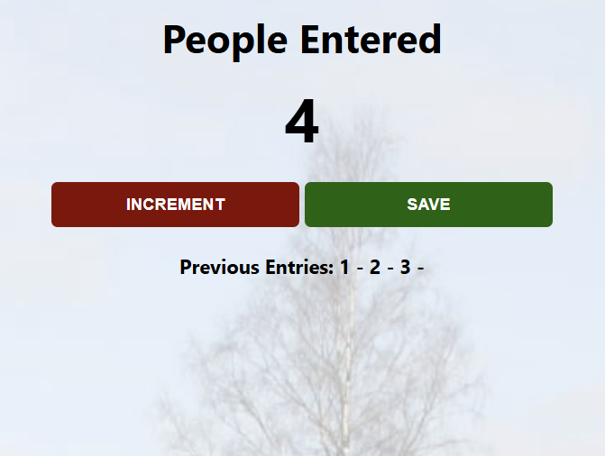

<div align="center">

# 👥 People Counter App

### A simple interactive counter application built with **HTML, CSS & JavaScript**

Track entries, save previous counts, and practise core JavaScript concepts including **DOM manipulation**, **functions**, and **event handling**.

<br>


</div>

---

# 📖 Overview

The **People Counter App** is a lightweight web application that allows users to track how many people enter a location.

The project was built to strengthen my understanding of JavaScript fundamentals by connecting user interactions with dynamic webpage updates.

Users can increase the counter, save previous entries, and reset the count for the next session.

---

# ✨ Features

- 👥 Live people counting
- ➕ Increment counter functionality
- 💾 Save previous entries
- 🔄 Automatic counter reset after saving
- ⚡ Real-time UI updates
- 🎨 Custom background styling
- 📱 Simple responsive design

---

# 🛠️ Tech Stack

| Technology | Purpose |
|------------|---------|
| HTML5 | Structure and content |
| CSS3 | Styling and layout |
| JavaScript | Application logic |
| DOM Manipulation | Dynamic webpage updates |

---

# 📂 Project Structure

```text
people-counter-app/
│
├── index.html
├── index.css
├── index.js
├── station.jpg
│
├── screenshots/
│   └── people-counter-app-screenshot.png
│
└── README.md
```

---

# 🎯 What I Learned

Through building this project, I practised:

- Selecting HTML elements using JavaScript
- Using variables to store application state
- Creating and calling functions
- Handling button click events
- Updating webpage content dynamically
- Using `textContent` to modify elements
- Structuring a small front-end project

---

# 📸 Preview

<p align="center">
  
</p>

---

<div align="center">

## 👨‍💻 Created by Aariz

Building projects and improving one step at a time 🚀

</div>
